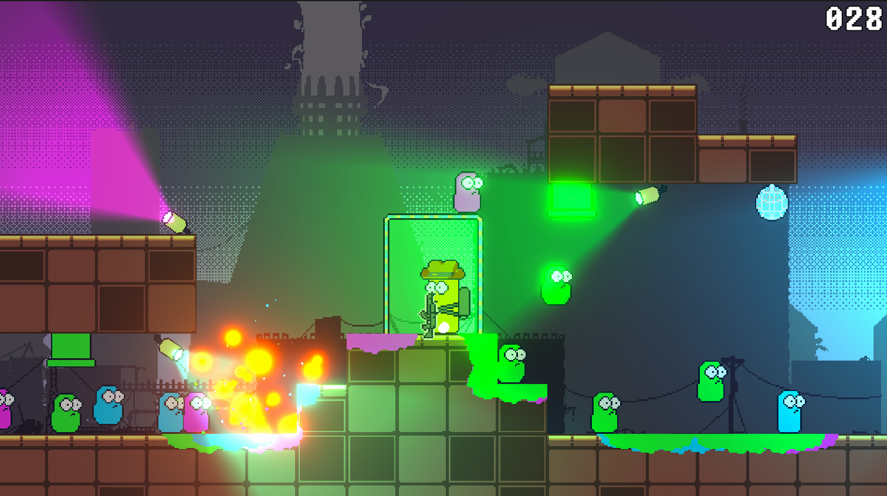

# Laugh And Fire

Game project that was made in Mastering Game Feel Course GameDevTV. This project main focus's is improving game feeling experience, i.e, making game more immersive like adding VFX and SFX.

Things that mostly I applied

* Object pooling
* Observer pattern
* Singleton pattern
* Cinemachine impulse listener
* AudioMixer
* Communicating classes via Interfaces
* Sprite mask
* New input system (C# events)
